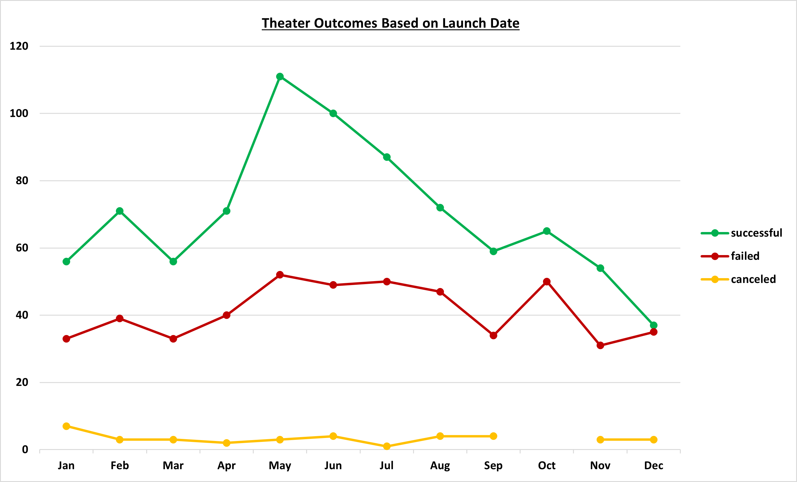
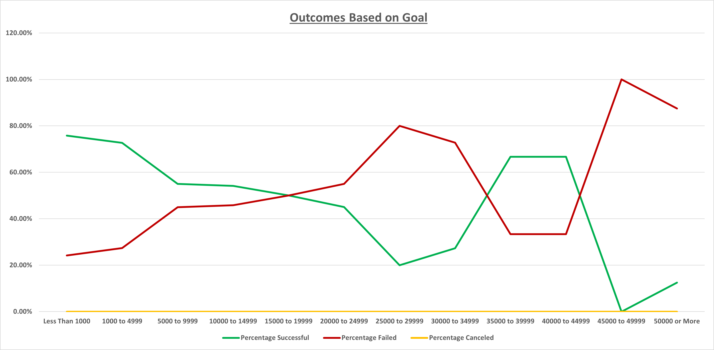

# A Data Analysis for Louise's Campaign
Kickstarter Data Analysis
## Overview of Project
Analyzing how different campaigns fared in relation to their launch dates and their funding goals to gear Louise's campaign towards success. Through visual feedback we provide Louise with a realistic fundraising goal and start date. 
#### On the Line charts below you see a visual representation of the dataset showing campaign outcomes based on when they began and where they set their fundraising goal.

### Analysis of Outcomes Based on Launch Date

- Based on the data visualization above, we can conclude that the best month to start a successful theater campaign would be May followed by June, July, and August.

### Analysis of Outcomes Based on Goals

- The most successful campaigns had a fundraising goal of $5000 or less.

### Challenges and Difficulties Encountered
* When selecting the data table created in "Outcomes Based on Goals" and creating a line graph to visualize, the Percentage canceled data wasn't showing on the graph. I checked my forumlas and that the correct data was inserted and found that I had selected the incorrect chart type resulting in the issue.

## Results

### What are two conclusions you can draw about the Outcomes based on Launch Date?
1. The dataset suggests that Louise start her campaign in May for the best results.
2. If she started her campaign in the month of December or November, her chances of success would drop dramatically.

### What can you conclude about the Outcomes based on Goals?
1. To be the most successful, Loise should set a fundraising goal of $5000 or less.
2. Failed campaigns have a much higher goal than that of successful campaigns.

### What are some limitations of this dataset?
1. Our current dataset is about 6-8 years old. This suggests that more recent data should be used to uncover more current trends, allowing Louise to be most successful.
2. The outcomes of each play campaign may have been influenced by the genre. If this data was included, we would be able to determine whether a certain genre category was more successful than others.

### What are some other possible tables and/or graphs that we could create?
1. We could create a table and line graph representating the longevity of a campaign in reference to the outcome it received.
2. Secondly, we could include a visualization comparing the average donation and the duration of the campaign to uncover a possible correlation between the two and the outcome of the campaign.
